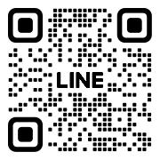
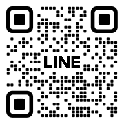
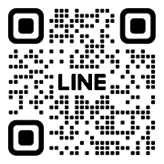

# Workshop 3: สร้างบอตของตัวเอง/ต่อยอดจากโปรเจคตัวอย่าง

เราเพิ่งได้ดูการใช้งาน API และการเก็บข้อมูลระยะยาวมาแล้ว
จากนี้เราสามารถสร้างบอตที่ซับซ้อนมากขึ้น มีการเก็บข้อมูลเพื่อนำไปใช้ภายหลัง มีการเรียก API จากที่อื่นเพื่อนำข้อมูลมาใช้

มีโปรเจคตัวอย่างให้ 3 โปรเจคดังนี้

- **โปรเจค 1: [Expense Memo](https://codesandbox.io/p/devbox/expense-memo-template-th-5wslx3) - บอตจดรายจ่าย**
  - ลองเล่น  
    
  - ความสามารถที่มีในโปรเจคนี้
    - จดรายจ่าย
    - รายงานค่าใช้จ่ายรวมในระยะเวลาที่กำหนด

  - ตัวอย่างฟีเจอร์ที่สามารถเพิ่มเข้าไปได้
    - แสดง 10 รายการล่าสุด
    - ลบรายการที่ไม่ต้องการ

- **โปรเจค 2: [Vocab Flash Card](https://codesandbox.io/p/devbox/vocab-flashcard-template-th-h73ygf) - บอตเล่นเกมทายศัพท์**
  - ลองเล่น  
    
  - ความสามารถที่มีในโปรเจคนี้
    - ส่งศัพท์ภาษาอังกฤษเพื่อให้ผู้ใช้ทายคำแปลภาษาไทย
  - ตัวอย่างฟีเจอร์ที่สามารถเพิ่มเข้าไปได้
    - รวมคะแนนและรายงานคะแนนประจำสัปดาห์
    - ให้โอกาสทายซ้ำถ้าทายผิด แต่ให้ครึ่งคะแนน

- **โปรเจค 3: [Weather Bot](https://codesandbox.io/p/devbox/weather-bot-template-th-pkrgn2) - บอตรายงานสภาพอากาศ**
  - ลองเล่น  
    
  - ความสามารถที่มีในโปรเจคนี้
    - ให้ผู้ใช้กำหนดจังหวัดที่ตัวเองอยู่
    - รายงานสภาพอากาศทุกเช้า
    - เตือนภัยหากสภาพอากาศแย่ในชั่วโมงข้างหน้า

  - ตัวอย่างฟีเจอร์ที่สามารถเพิ่มเข้าไปได้
    - ขอรายงานอากาศทันที
    - แจ้งว่าฝนจะหยุดตอนไหน
   
- **[โปรเจคเปล่า](https://codesandbox.io/p/devbox/empty-template-th-xdhgrq) - ถ้าเทพ ลุยเลย**
  - มีตัวรับและส่งข้อความ LINE ให้
  - มีตัวสร้าง database เปล่าๆให้

## โครงสร้างโปรเจค

ทั้ง 3 โปรเจคนี้มีโครงสร้างคล้ายๆกัน เนื่องจากเป็นโปรเจคที่ซับซ้อนขึ้น จึงมีการแบ่งโค้ดออกเป็นไฟล์หลายไฟล์และโฟล์เดอร์ดังนี้

- `src/` - โฟล์เดอร์หลักของโปรเจค
  - `index.js` - ไฟล์หลักของแอปพลิเคชัน
  - `data/` - โฟล์เดอร์เกี่ยวกับการจัดเก็บข้อมูล
    - `db.js` - เชื่อมต่อฐานข้อมูล + ฟังก์ชันสำหรับการจัดการข้อมูล
    - บางโปรเจคจะมีไฟล์ `.json` อยู่ด้วย เป็นข้อมูลตั้งต้นในการเริ่มระบบ
  - `line/` - โฟล์เดอร์เกี่ยวกับการส่งข้อความผ่าน LINE
    - `messageHandler.js` - ตัวรับข้อความจาก LINE, ประมวลผล, และส่งกลับ
    - `messageSender.js` - ตัวช่วยส่งข้อความตอบกลับไปยัง LINE ให้ง่ายขึ้น
    - บางโปรเจคจะมีไฟล์ `schedules.js` อยู่ด้วย เป็นตัวจัดการกับการส่งข้อความตามเวลาที่กำหนด
  - `routes/` - โฟล์เดอร์เกี่ยวกับการรับ request ของ server chatbot
    - `line-webhook.js` - ตัวจัดการกับ request ที่เกี่ยวกับ LINE
  - บางโปรเจคมีโฟลเดอร์อื่นๆอยู่ด้วย เช่น `weather/` เพื่อการจัดการกับข้อมูลสภาพอากาศ หรืออื่นๆ

## การ Setup โปรเจคใน Codesandbox

เนื่องจากโปรเจคใน Workshop 3 นี้เป็นโปรเจคที่ใหญ่ขึ้น การ Setup โปรเจคใน Codesandbox จึงมีขั้นตอนเพิ่มเติมเล็กน้อยเมื่อเทียบกับ Workshop 1 และ 2 ดังนี้

0. สร้างบอตใหม่ตามขั้นตอนใน[ไฟล์นี้](0_Create_LINE_bot.md)
1. ไปที่ลิงค์ของโปรเจคที่ต้องการ
2. กดปุ่ม "Fork" ที่มุมขวาบนของหน้า
3. หลังจาก Fork แล้ว โปรเจคที่เห็นในจอจะเปลี่ยนเป็นโปรเจคที่เป็นของคุณเอง 
4. กดปุ่ม "Share" ที่มุมขวาบนของหน้า
5. กดปุ่ม "Move out of Drafts"
6. ที่ "Change permissions" ให้เลือก "Unlisted" เพื่อทำให้โปรเจคสามารถเข้าถึงได้
7. จากนั้นตั้งค่า Environment variables ใน Codesandbox โดย
  - กดเมนู Codesandbox (กล่องสี่เหลี่ยมมุมซ้ายบน) > Settings > Env Variables
  - ใส่ Environment variables ดังนี้
    - `LINE_CHANNEL_ACCESS_TOKEN` - channel access token จาก LINE Developers Console
    - `LINE_CHANNEL_SECRET` - channel secret จาก LINE Developers Console
  - กด Restart microVM
8. ใน Codesandbox จอครึ่งขวาจะเป็น Browser ที่มีลิงค์อยู่ด้านบน ให้เติม `/webhook/line` ต่อท้ายแล้วนำทั้งหมดนั้นไปวางในหน้า "Messaging API" ของบอต ในช่อง "Webhook URL" _(ตัวอย่าง: สมมุติ URL ในหน้า Codesandbox คือ `https://blablabla.codesandbox.io`; แก้ไขให้เป็น `https://blablabla.codesandbox.io/webhook/line` แล้วนำไปใส่ใน Webhook URL)_
9. กดเปิด "Use webhook" ถ้าหากยังไม่ได้เปิด
